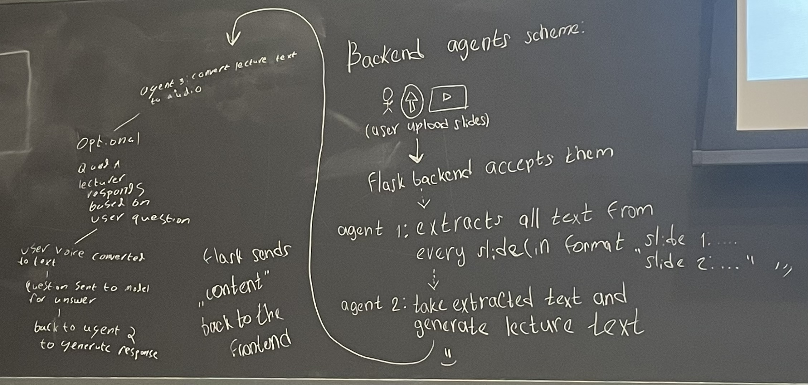

# YHack 2024 - Lecture-Agent

## What it is

Lecture Agent takes those dreadful class slides that feel like quicksand to go through alone and builds your very own AI lecture presentation. It takes the uploaded slide notes and intelligently generates a fully narrated, professor-like presentation, breaking down even the most complex concepts into digestible explanations. This allows users to experience a seamless, interactive lecture experience.

## How we come up with this idea

3 AM, just the light of Jacob computer in his dorm room. Reading through 3 weeks worth of lecture slides to make up for getting the flu. With no recorded lectures, the task of learning multivariable calculus was up to me. After ten slides, he couldn't seem to keep his eyes open. The same boring moments with no one to explain it to me made me vow to never make anyone go through what I had to endure. We set out to make a program to do just that. Lecture agent ensures that no matter your circumstances, you're never left behind. With Lecture-Agent, you can study class materials from anywhere, anytime with a personalized AI-driven professor who delivers dynamic lectures based on your course content.

At Davies Auditorium of Yale, we team of 4 came up this idea and drew the structure on the blackboard and started everything... 



Follow these steps to set up and run the project:
## Move to the backend
1. Create a virtual environment:

    - **MacOS and Linux:**
        ```bash
        python3 -m venv venv
        ```
    - **Windows:**
        ```bash
        python -m venv venv
        ```

2. Activate the virtual environment:

    - **MacOS and Linux:**
        ```bash
        source venv/bin/activate
        ```
    - **Windows:**
        ```bash
        venv\Scripts\activate
        ```

**Note:** To deactivate the virtual environment:
    ```deactivate```

3. Install python dependecies:
    ```bash
    pip install -r requirements.txt
    ```

4. Install npm dependecies for the React frontend and build it:
    - **MacOS and Linux:**
        ```bash
        cd frontend/ && npm i && npm run build && cd ..
        ```
    - **Windows (PowerShell):**
        ```bash
        cd frontend/; if ($?) { npm i }; if ($?) { npm run build }; if ($?) { cd .. }
        ```

5. To run the server:
    ```bash
    python ./app.py
    ```
    ```
    flask --app app run
    ```

6. To run the whole thing:
```bash
    cd react-app/ && npm i && npm run build && cd .. && python3.12 backend/app.py
```
